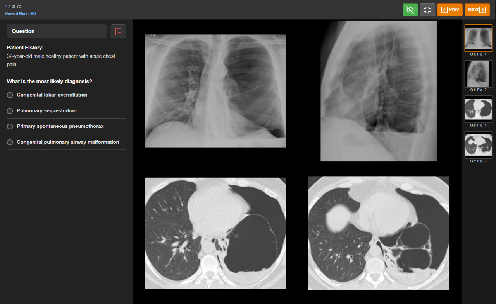
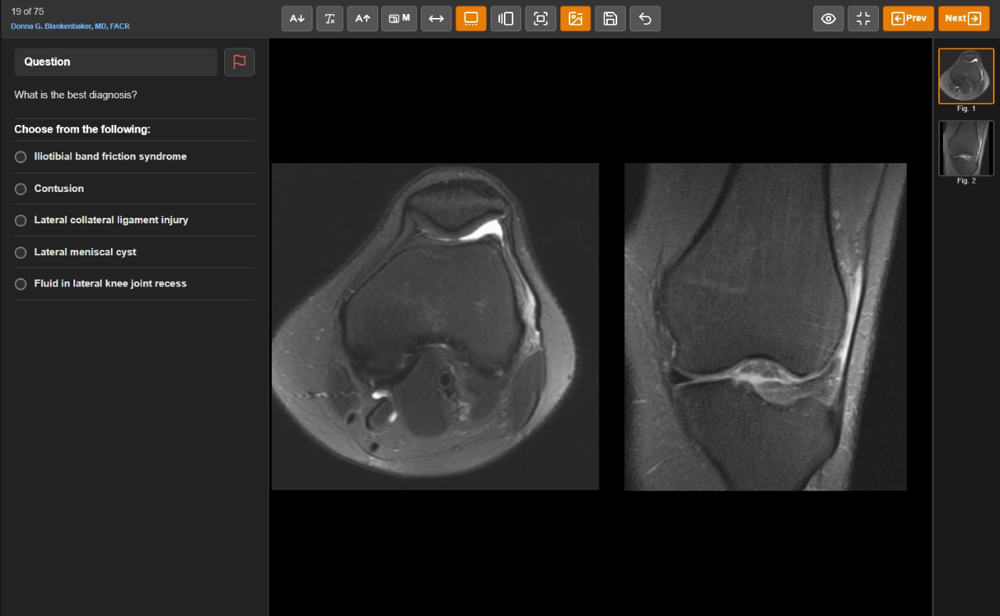
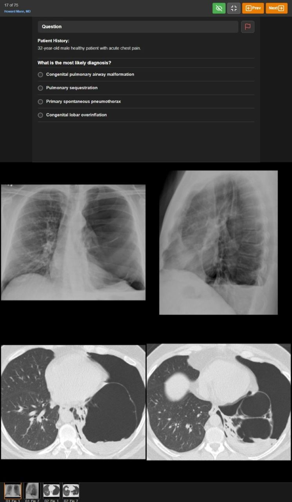
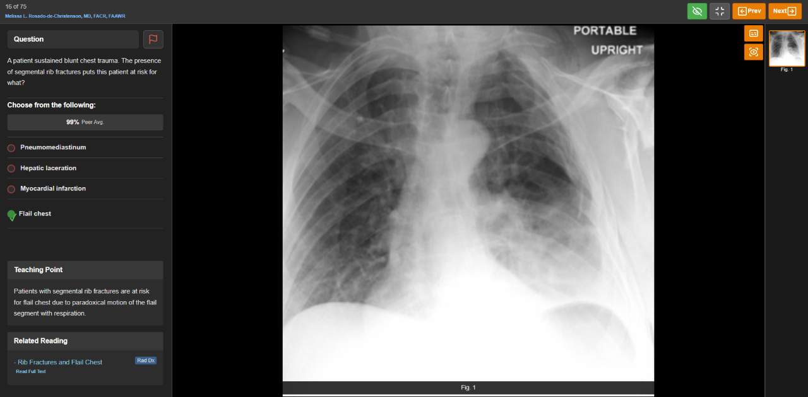

# RadPrimer Enhancer

Enhance your RadPrimer study experience with a powerful, customizable fullscreen interface designed for quizzes and cases.

Tired of the default RadPrimer interface limitations? RadPrimer Enhancer provides a focused, flexible, and efficient environment for reviewing cases and tackling quizzes, putting you in control of your study layout.

## Screenshots

*The main enhanced fullscreen interface:*

 

 

 

## Key Features

*   **✨ Enhanced Fullscreen Mode:** A dedicated, clean UI removes distractions for focused study.
*   **📐 Layout Customization:**
    *   Adjust **font size** for questions and answers.
    *   Resize the **question panel** width (horizontal) or height (vertical).
    *   Show/hide **thumbnails** and position them (Bottom, Right, Top, Left - adapts for vertical).
    *   Adjust the overall **viewport width** on large monitors (Full, Large, Medium, Small).
    *   Automatic **vertical layout** adaptation with top/bottom panel positioning.
*   **🖼️ Flexible Image Viewing:**
    *   Toggle between **Grid** (paginated) and **Single Image** views instantly.
    *   Choose **Contain** (fit whole image) or **Cover** (fill space) image fitting.
    *   Quickly toggle **Annotations** and **Captions**.
*   **⌨️ Efficient Navigation:**
    *   Use keyboard shortcuts for **Next/Previous Question** (`=`, `-`).
    *   Select answers using **Number Keys** (`1-9`) or **Letter Keys** (`A-Z`).
    *   Navigate images in single view or paginate the grid using **Arrow Keys**.
*   **📱 Mobile Friendly:**
    *   **Swipe** left/right on images to navigate.
    *   **Double-tap** images to toggle between Grid and Single view.
*   **💡 Smart Interaction:**
    *   **Right-click** answer options to **strike-through** visually.
    *   Clear feedback on **selected, correct, and incorrect** answers.
    *   Integrated display of **Teaching Points**, **Related Reading**, and **Peer Averages**.
*   **⚙️ Persistent & Personal:**
    *   Remembers your layout preferences using `localStorage`.
    *   **Save** your current setup as the default layout.
    *   **Load** your saved default layout anytime.

## Installation

**1. Chrome Web Store (Recommended):**

*   [Link to RadPrimer Enhancer on Chrome Web Store] - *(Coming Soon / Replace with actual link when published)*

**2. Manual Installation (for Development or Testing):**

1.  Download the latest release `.zip` file from the [Releases page]([Link to your GitHub Releases page]) OR Clone this repository: `git clone [Your Repo URL]`
2.  Open Google Chrome and navigate to `chrome://extensions`.
3.  Enable "Developer mode" using the toggle switch in the top right corner.
4.  If you downloaded a `.zip`, unzip it first.
5.  Click the "Load unpacked" button.
6.  Select the directory where you unzipped or cloned the repository (it should contain the `manifest.json` file).

## How to Use

1.  Make sure the extension is installed and enabled.
2.  Start the test/quiz in radprimer.
3.  Look for the **"Fullscreen" button** added by the extension near the top right of the standard RadPrimer interface (usually next to the "Flag" button).
4.  Click the "Fullscreen" button to activate the enhanced interface.
5.  Use the controls in the top navigation bar of the enhanced view to customize the layout (font size, panel size, view modes, etc.).
6.  Interact using mouse clicks, keyboard shortcuts (see Features), or touch gestures on mobile.
7.  To exit, click the "Exit Fullscreen" button (looks like a Minimize icon) in the top right of the enhanced view, or the original "Exit Fullscreen" button if it reappears.

## Permissions Explained

This extension requires the following permission:

*   **Host Permission (`*://*.radprimer.com/assessment*`):** This is necessary to allow the extension's code (content script) to run on RadPrimer pages. It needs this access to:
    *   Read the existing page content (questions, answers, image URLs) to display them in the enhanced view.
    *   Modify the page structure to inject the enhanced fullscreen interface.
    *   Add the initial "Fullscreen" toggle button to the standard RadPrimer UI.

*The extension operates entirely within your browser on the RadPrimer pages you visit.*

## Privacy Policy

Your privacy is important. This extension is designed to work locally within your browser and does not collect or transmit personal data.

Please review the full [**Privacy Policy**](privacy.md) for detailed information on data handling.

## Contributing

Contributions, issues, and feature requests are welcome! Please feel free to:

*   Open an issue on the [GitHub Issues page]([Link to your GitHub Issues page]) to report bugs or suggest features.
*   Fork the repository and submit a pull request with your improvements.

## Reporting Issues

If you encounter any bugs or problems, that sucks. Please don't report. I didn't make this for anyone. Just for me.

